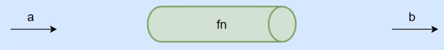
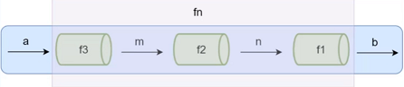
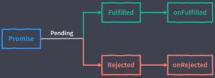

# Part 1 · JavaScript 深度剖析

## 任务一：函数式编程范式

### 1.课程介绍

- 为什么要学习函数编程以及什么是函数式编程
- 函数式编程的特性（纯函数、柯里化、函数组合）
- 函数式编程的应用场景
- 函数式编程库 Lodash

### 2.为什么要学习函数编程以及什么是函数式编程

- 函数式编程是随着 React 的流行受到越来越多的关注
- Vue3 也开始拥抱函数式编程
- 函数式编程可以抛弃 this
- 打包过程中可以更好的利用 tree shaking 过滤无用代码
- 方便测试 方便并行处理
- 有很多库可以帮助我们进行函数式开发： lodash、underscpre、ramda

### 3.函数式编程概念

函数式编程(Functional Programming，FP)，FP 是编程范式之一，我们常听说的编程范式还有面向过程编程、面向对象编程。

- 面向对象编程的思维方式：把现实世界中的事物抽象成程序世界中的类和对象，通过封装、继承和多态来演示事物事件的联系
- 函数式编程的思维方式：把现实世界的事物和事物之间的**联系**抽象到程序世界（对运算过程进行抽象）
  - 程序的本质：根据输入通过某种运算获得相应的输出，程序开发过程中会设计很多有输入和输出的函数
  - x->f(联系、映射)->y, y=f(x)
  - **函数式编程中的函数指的不是程序中的函数(方法)**，而是数学中的函数即映射关系，例如：y=sin(x), x和y的关系
  - **相同的输入始终要得到相同的输出**(纯函数)
  - 函数式编程用来描述数据(函数)之间的映射

### 4.函数是一等公民

- 函数可以存储在变量中
- 函数作为参数
- 函数作为返回值

在 JavaScipt 中**函数就是一个普通的对象**(可以通过 new Function())，我们可以把函数存储到变量/数组中，它还可以作为另一个函数的参数和返回值，甚至我们可以在程序运行的时候通过 new Function('alert(1)') 来构造一个新的函数

### 5.高阶函数-函数作为参数

什么是高阶函数

- 高阶函数
  - 可以把函数作为参数传递给另一个函数
  - 可以把函数作为另一个函数的返回结果

```JavaScript
function forEach(array, fn){
    for(let i = 0; i < array.length; i++) {
        fn(array[i])
    }
}
let arr = [1, 3, 4, 7, 8]
forEach(arr, function(item){
    console.log(item)
})
```

### 6.高阶函数-函数作为返回值

```JavaScript
function makeFn(){
    let msg = 'Hello function'
    return function(){
        console.log(msg)
    }
}
const fn = makeFn()
fn()
```

### 7.高阶函数的意义

- 抽象可以帮我们屏蔽细节，只需要关注我们的目标
- 高阶函数是用来抽象通用的问题

### 8.常用的高阶函数

```JavaScript
// 模拟常用的高阶函数： map、every、some
const map = (array, fn) => {
   let results = []
   for(let value of array) {
       results.push(fn(value))
   }
   return results
}

const every = (array, fn) => {
   let result = true
   for(let value of array) {
       result = fn(value)
       if(!result) {
            break
        }
   }
   return result
}

const some = (array, fn) => {
   let result = false
   for(let value of array) {
       result = fn(value)
       if(result) {
            break
        }
   }
   return result
}
```

### 9.闭包-概念

- 闭包(Closure)：函数和其周围的状态(词法环境)的引用捆绑在一起形成闭包
  - 可以在另一个作用域中调用一个函数的内部函数并访问到该函数的作用域的成员

```JavaScript
function once(fn) {
    let done = false
    if(!done) {
        done = true
        return fn.apply(this, arguments)
    }
}
let pay = once(function(money) {
    console.log(`支付： ${money} RMB`)
})

// 只会支付一次
pay(5)
pay(5)
```

- 闭包的本质：函数在执行的时候会放到一个执行栈上，当函数执行完毕之后会从执行栈上移除，**但是堆上的作用域成员因为被外部引用不能释放**，因此内部函数依然可以访问外部函数的成员

### 10.闭包-案例

```JavaScript
// Matn.pow(4, 2)
// Matn.pow(5, 2)
function makePower(power) {
    return function(number) {
        return Math.power(number, power)
    }
}
// 求平方
let power2 = makePower(2)
let power3 = makePower(3)
```

### 11.纯函数概念

- 纯函数：**相同的输入永远会得到相同的输出**，而且没有任何可观察的副作用
  - 纯函数就类似数学中的函数(用来描述输入和输出之前的关系)，y=f(x)
  - lodash 是一个纯函数的功能库，提供了对数组、数字、对象、字符串、函数等操作的一些方法
  - 数组的 slice 和 splice 分别是：纯函数和不纯的函数
    - slice 返回数组中的指定部分，不会改变原数组
    - splice 对数组进行操作返回该数组，会改变原数组
  - 函数式编程不会保留计算中间的结果，所以变量是不可变的(无状态的)
  - 我们可以把一个函数的执行结果交给另一个函数去处理

### 12.Lodash

```JavaScript
// 演示 lodash
// fisrt / last / toUpper / reverse / each / includes / find / findIndex
const _ = require('lodash')
const array = ['jack', 'tom', 'luck', 'kate']

console.log(_.first(array))
console.log(_.last(array))
console.log(_.toUpper(_.first(array)))
console.log(_.reverse(array))

const r = _.each(array,(item, index) =>{
    console.log(item, index)
})
console.log(r)
```

### 13.纯函数的好处

- 可缓存
  - 因为纯函数对相同的输入始终有相同的结果，所以可以把纯函数的结果缓存起来
- 可测试
  - 纯函数让测试更方便
- 并行处理
  - 在多线程环境下并行操作共享的内容数据很可能会出现意外情况
  - 纯函数不需要访问共享的内存数据，所以在并行环境下可以任意运行纯函数(Web Worker)

```JavaScript
const _ = require('lodash')

function getArea(r) {
    console.log(r)
    return Math.PI * r * r
}

// let getAreaWidthMemory = _memoize(getArea)

// console.log(getAreaWidthMemory(4))
// console.log(getAreaWidthMemory(4))
// console.log(getAreaWidthMemory(4))

// 模拟 memoize 方法的实现

function memoize(f){
   let cache = {}
   return function(){
      let key = Json.stringify(arguments)
      cache[key] = cache[key] || f.apply(f,arguments)
      return cache[key]
   }
}

```

### 14.副作用

```JavaScript
// 不纯的
let mini = 18
function checkAge(age) {
    return age >= mini
}
// 纯的(有硬编码、后续可以通过柯里化解决)
function checkAge(age) {
    let mini = 18
    return age >= mini
}
```

副作用让一个函数变的不纯(如上例)，纯函数根据相同的输入返回相同的输出，如果函数依赖于外部的状态就无法保证输出相同，就会带来副作用

副作用来源：

- 配置文件
- 数据库
- 获取用户的输入
- ...

所有的外部交互都有可能产生副作用，副作用也使得方法通用性下降，不适合扩展和可重用性，同时副作用会给程序中带来安全隐患和不确定性，但是副作用不可能完全禁止，进可能控制它们在可控范围内发生。

### 15.柯里化

柯里化(Curring):

- 当一个函数有多个参数的时候先传递一部分参数调用它(这部分参数以后永远不变)
- 然后返回一个新的函数接收剩余的参数，返回结果

- 使用柯里化解决上一个案例中的硬编码问题

```JavaScript
function checkAge(age) {
    let mini = 18
    return age >= mini
}

// 普通纯函数
function checkAge(min, age){
    return age >= min
}

checkAge(18, 24)
checkAge(18, 20)
checkAge(20, 30)

// 柯里化
function checkAge(min) {
    return function(age){
        return age >= min
    }
}

// ES6 写法
let checkAge = min => (age => age >= min)

let checkAge18 = checkAge(18)
let checkAge20 = checkAge(20)

checkAge18(24)
checkAge18(20)
```

### 16.Lodash 中的柯里化方法

- _curry(func)
  - 功能：创建一个函数，该函数接收一个或多个 func 的参数，如果 func 所需要的参数都被提供则执行 func 并返回执行的结果。否则继续返回该函数并等待接收剩余的参数。
  - 参数：需要柯里化的参数
  - 返回值：柯里化后的函数

```JavaScript
const _ = require('lodash')
// 要柯里化的函数
function getSum(a, b, c) {
    return a + b + c
}

let curried = _.curry(getSum)

console.log(curried(1, 2, 3))
console.log(curried(1)(2, 3))
console.log(curried(1, 2)(3))
```

### 17.柯里化案例

```JavaScript
// ''.match(/\s+/g)
// ''.match(/\d+/g)
const _ = require('lodash')
const match = _.curry(function(reg, str){
    return str.match(reg)
})

const haveSpace = match('/\s+/g)
const haveNumber = match('/\d+/g)

console.log(haveSpace('helloworld'))
console.log(haveNumber('abc'))

const filter = _.curry(function(func, array){
    return array.filter(func)
})

console.log(filter(haveSpace, ['John Connor', 'John_Done']))

const findSpace = filter(haveSpace)

console.log(findSpace(['John Connor', 'John_Done']))

```

### 18.柯里化原理模拟

```JavaScript
function curry(func) {
    return function curriedFn(...args){
        // 判断实参和形参的个数
        if(args.length < func.length){
            return function(){
                return curriedFn(...args.concat(Array.from(arguments)))
            }
        }else{
            return func(...args)
        }
    }
}

```

### 19.柯里化总结

- 柯里化可以让我们给一个函数传递较少的参数得到一个已经记住了某些固定参数的新函数
- 这是一种对函数参数的'缓存'
- 让函数变的更灵活， 让函数的粒度更小
- 可以把多元函数转换成一元函数，可以组合使用函数产生强大的功能

### 20.函数组合概念

- 纯函数和柯里化很容易写出洋葱代码 h(g(f(x)))
  - 获取数组的最后一个元素再转换成大写字母，_.toUpper(_.first(_reverse(array)))
  - 函数组合可以让我们把细粒度的函数重新组合生成一个新的函数

> 管道

下面这张图表示程序中使用函数处理数据的过程，给 fn 函数输入参数 a，返回结果 b。可以想象 a 数据通过一个管道得到了 b 数据。



当 fn 函数比较复杂的时候，我们可以把函数 fn 拆分成多个小函数，此时多了中间运算过程产生的 m 和 n。
下面这张图中可以想象成把 fn 这个管道拆分成了3个管道 f1,f2,f3,数据 a 通过管道 f3 得到结果 m，m 再通过管道 f2 得到结果 n，n 通过管道 f1 得到最终结果 b。



```JavaScript
fn = compose(f1, f2, f3)
b = fn(a)
```

> 函数组合

- 函数组合(compose)：如果一个函数要经过多个函数处理才能得到最终值，这个时候可以把中间过程的函数合并成一个函数
  - 函数就像是数据的管道，函数组合就是把这些管道连接起来，让数据穿过多个管道形成最终结果
  - **函数组合默认是从右到左执行**

```JavaScript
// 函数组合演示
fn = compose(f, g) {
    return function(value) {
        return f(g(value))
    }
}
function reverse(array) {
    return array.reverse()
}
function first(array) {
    return array[0]
}
const last = compose(first, reverse)
console.log(last([1, 2, 3, 4]))
```

### 21.Lodash中的组合函数

- lodash 中的组合函数
  - lodash 中组合函数 flow() 或者 flowRight(),他们都可以组合多个函数
  - flow() 是从左到右运行
  - flowRight() 是从右到左运行，使用的更多一些

```JavaScript
// lodash 中的函数组合方法 _flowRight()
const reverse = arr => arr.reverse()
const first = arr => arr[0]
const toUpper = s => s.toUpperCase()

const f = _flowRight(toUpper,first,reverse)

console.log(f(['one', 'two', 'three']))
```

### 22.组合函数原理模拟

```JavaScript
// lodash 中的函数组合方法 _flowRight()
const reverse = arr => arr.reverse()
const first = arr => arr[0]
const toUpper = s => s.toUpperCase()

const f = _flowRight(toUpper,first,reverse)

console.log(f(['one', 'two', 'three']))

// function compose(...args) {
//     return function(value){
//         return args.reverse().reduce(function(acc, fn){
//             return fn(acc)
//         },value)
//     }
// }

const compose = (...args) => value => args.reverse().reduce((acc, fn) => fn(acc),value)
```

### 23.函数组合-结合律

- 函数组合要满足结合律(associativity)：
  - 我们既可以把 g 和 h 组合，还可以把 f 和 g 组合，结果都是一样的

```JavaScript
// 结合律(associativity)
let f = compose(f, g, h)
let associativite = compose(compose(f, g),h) == compose(f, compose(g, h))
```

### 24.函数组合-调试

```JavaScript
// NEVER SAY DIE --> never-say-die
const _ = require('lodash')

// const log = v => {
//     console.log(v)
//     return v
// }

const trace = _.curry((tag, v) => {
    console.log(tag,v)
    return v
})

const split = _.curry((sep, str) => _.split(str, sep))
const join = _.curry((sep, str) => _.join(array, sep))
const map = _.curry((fn, array) => _.map(array, fn))

const f = _.flowRight(join('-'), map(_.toLower), split(' '))

console.log(f('NEVER SAY DIE'))
```

### 25.Lodash-fp 模块

- lodash/fp
  - lodash 的 fp 模块提供了使用的对**函数式编程友好**的方法
  - 提供了不可变 auto-curried iteratee-first data-last 的方法

```JavaScript
// lodash 模块
const _ = require('lodash')

_.map(['a', 'b', 'c'],_.toUpper)
// => ['A', 'B', 'C']
_.map(['a', 'b', 'c'])
// => ['a', 'b', 'c']

_.split('Hello World', ' ')

// lodash/fp 模块
const fp = require('lodash/fp')

fp.map(fp.toUpper,['a', 'b', 'c'])
fp.map(fp.toUpper)(['a', 'b', 'c'])

fp.split(' ', 'Hello World')
fp.split(' ')('Hello World')

const f = fp.flowRight(fp.join('-'), fp.map(fp.toLower), fp.split(' '))
console.log(f('NEVER SAY DIE'))
```

### 26.Lodash-map 方法的小问题

```JavaScript
// const fp = require('lodash')

// console.log(_.map(['23', '8', '10'], parseInt))
// // => [23, NAN, 2]
// parseInt('23', 0, array)
// parseInt('8', 1, array)
// parseInt('10', 2, array)

const fp = require('lodash/fp')

console.log(fp.map(parseInt, ['23', '8', '10']))

// 总结：_.map 传递给 parseInt 参数有三个  fp.map 只有一个
```

### 27.Pointfree

**Pointfree**：我们可以把数据处理的过程定义成与数据无关的合成运算，不需要用到代表数据的那个参数，只要把简单的运算步骤合成到一起，在使用这种模式之前我们需要定义一些辅助的基本运算函数

- 不需要指明处理的数据
- **只需要合成运算过程**
- 需要定义一些辅助的基本运算函数

```JavaScript
const f = fp.flowRight(fp.join('-'), fp.map(fp.toLower), fp.split(' '))
```

- 案例演示

```JavaScript
// 非 Point Free 模式
// Hello World => hello_world
funciton f(word) {
    return word.toLowerCase().replace(/\s+/g, '_');
}

// Point Free
const fp = require('lodash/fp')
const f = fp.flowRigth(fp,replace(/\s+/g, '_'), fp.toLower)

console.log(f('Hello World'))
```

### 28.Pointfree-案例

```JavaScript
// 把一个字符串中的首字母提取并转换成大写，使用. 作为分隔符
// world wild web ==> W. W. W
const fp = require('lodash/fp')
// const firstLetterToUpper = fp.flowRight(fp.join('. '), fp.map(fp.first), fp.map(fp.toUpper), fp.split(' '))
const firstLetterToUpper = fp.flowRight(fp.join('. '), fp.flowRight(fp.first,fp.toUpper), fp.split(' '))

console.log(firstLetterToUpper('world will web'))
```

### 29.Functor

> 为什么要学函子

到目前为止已经学习了函数式编程的一些基础，但是我们还没有演示在函数式编程中如何把副作用控制在可控的范围内、异常处理、异常操作等。

> 什么是Functor

- 容器：包含值和值的变形关系(这个变形关系就是函数)
- 函子：是一个特殊的容器，通过一个普通的对象来实现，该对象具有 map 方法，map 方法可以运行一个函数对值进行处理(变形关系)

```JavaScript
class Container {
   static of(value) {
       return new Container(value)
   }
   constructor (value){
       this._value = value
   }

   map(fn){
        return new Container(fn(this._value))
   }
}
let r = Container.of(5).map(x => x + 2).map(x => x * x)
```

### 30.Functor总结

- 总结
  - 函数式编程的运算不直接操作值，而是由函子完成
  - 函子就是实现了一个 map 契约的对象
  - 我们可以把函子想象成一个盒子，这个盒子里封装了一个值
  - 想要处理盒子中的值，我们需要给盒子的 map 方法传递一个处理值的函数(纯函数)，这个函数来对值进行处理
  - 最终 map 方法返回一个包含新值的盒子(函子)

### 31.MayBe函子

- 我们在编程的过程中可能会遇到很多错误，需要这些错误做相应的处理
- MayBe 函子的作用就是可以对外部的空值情况做处理(控制副作用在允许的范围)

```JavaScript
class MayBe {
    static of(value) {
       return new MayBe(value)
    }
    constructor (value) {
       this._value = value
    }

    map(fn){
        return this.isNothing() ? MayBe.of(null) : MayBe.of(fn(this._value))
    }

    isNothing() {
        return this._value === null || this._value === undefined
    }
}
let r = MayBe.of('hello world')
          .map(x => x.toUpperCase())
          .map(x => null)
          .map(x => x.split(' '))
```

### 32.Either函子

- Either 两者中的任何一个，类似于 if...else... 处理
- 异常会让函数变的不纯， Either 函子可以用来做异常处理

```JavaScript
class Left {
    static of(value) {
       return new Left(value)
    }
    constructor (value) {
       this._value = value
    }
    map(fn) {
        return this
    }
}
class Right {
    static of(value) {
       return new Right(value)
    }
    constructor (value) {
       this._value = value
    }
    map(fn) {
        return Right.of(fn(_this.value))
    }
}

function parseJSON(str) {
    try {
       return Right.of(JSON.parse(str))
    } catch (e) {
       return Left.of({error: e.message})
    }
}

```

### 33.IO函子

- IO 函子中的 _value 是一个函数，这里是把函数作为值来处理
- IO 函子可以把不纯的动作存储到 _value 中，延迟执行这个不纯的操作(惰性执行)，包装当前的操作
- 把不纯的操作交给调用者处理

```JavaScript
const fp = require('lodash/fp')
class IO {
    static of(x){
        return new IO(functio(){
            return x
        })
    }
    constructor (fn) {
        this._value = fn
    }
    map (fn) {
        // 把当前的 value 和传入的 fn 组合成一个新的函数
        return new IO(fp.flowRight(fn, this._value))
    }
}
let r = IO.of(process).map(p => p.execPath)
console.log(r._value)
```

### 34.Folktale

> Task 异步执行

- 异步任务的实现过于复杂，我们使用 folktale 中的 Task 来演示
- folktale 一个标准的函数式编程库
  - 和lodash、ramda不同的是，他没有提供很多功能函数
  - 只提供了一些函数式处理的操作，例如：compose、curry等，一些函子 Task、Either、MayBe等

```JavaScript
const { compose, curry } = require('folktale./core/lambda')
const { toUpper, first } = require('lodash/fp')

// 第一个参数是传入函数的参数个数
let f = curry(2, function(x, y) {
    console.log(x + y)
})
f(3, 4)
f(3)(4)

// 函数组合
let f = compose(toUpper, first)
f(['one', 'two'])
```

### 35.Task 函子

- Task 异步执行
  - folktale(2.3.2) 2.x中的Task和1.0中的Task区别很大，1.0中的用法更接近我们现在演示的函子
  - 这里以2.3.2来演示

```JavaScript
const fs = require('fs')
const { task } = require('folktale/concurrency/task')
const { split, find } = require('loadash/fp')
function readFile(filename) {
    return task(resolver => {
        fs.readFile(filename, 'utf-8', (err, data) => {
            if(err) resolver.reject(err)
            resolver.resolve(data)
        })
    })
}

readFile('package.json')
  .map(split('\n'))
  .map(find(x => x.includes('version')))
  .run()
  .listen({
     onRjected: err => {
         console.log(err)
     },
     onResolved: value => {
         console.log(value)
     }
})
```

### 36.Pointed函子

- Pointed 函子是实现了 of 静态方法的函子
- of 方法是为了避免使用 new 来创建对象，更深层的含义是 of 方法用来把值放到上下文 Context (把值放到容器中，使用 map 来处理值)

```JavaScript
class Container {
    static of (value) {
        return new Container(value)
    }
    ......
}
Container.of(2)
    .map(x => x + 5)
```

### 37.IO函子问题

```JavaScript
const fs = require('fs')
const { split, find } = require('loadash/fp')

class IO {
    static of(x){
        return new IO(functio(){
            return x
        })
    }
    constructor (fn) {
        this._value = fn
    }
    map (fn) {
        return new IO(fp.flowRight(fn, this._value))
    }
}

let readFile = function(filename) {
    return new IO(function() {
        return fs.readFileSync(filename, 'utf-8')
    })
}
let print = function(x) {
    return new IO(function() {
        console.log(x)
        return x
    })
}

let cat = fp.flowRight(print, readFile)
let r = cat('package.json')._value()._value()
console.log(r)
```

### 38.Monad 函子

- Monad函子是可以变扁的 Pointed 函子，IO(IO(x))
- 一个函子如果具有 join 和 of 两个方法并遵守一些定律就是一个 Monad

```JavaScript
const fs = require('fs')
const { split, find } = require('loadash/fp')

class IO {
    static of(x){
        return new IO(functio(){
            return x
        })
    }
    constructor (fn) {
        this._value = fn
    }
    map (fn) {
        return new IO(fp.flowRight(fn, this._value))
    }
    join() {
        return this._value()
    }
    flatMap(fn) {
        return this.map(fn).join()
    }
}

let readFile = function(filename) {
    return new IO(function() {
        return fs.readFileSync(filename, 'utf-8')
    })
}
let print = function(x) {
    return new IO(function() {
        console.log(x)
        return x
    })
}

let r = readFile('package.json')
        //    .map(x => x.toUpperCase())
           .map(fp.toUpper)
           .flatMap(print)
           .join()
```

### 39.总结

暂略

## 任务二：JavaScript 异步编程

### 1.概述

- 同步模式与异步模式
- 事件循环与消息队列
- 异步编程的几种方式
- Promise 异步方案、宏任务/微任务队列
- Generator 异步方案、Async/Await 语法糖

### 2.同步模式

- 代码中的任务依次执行

### 3.异步模式

- 不会去等待这个任务的结束才开始下一个任务
- 耗时任务开启过后就立即往后执行下一个任务
- 后续逻辑一般会通过回到函数的方式定义

### 4.回调函数

- 所有异步编程方案的根基
- 回到函数可以理解为一件你想要做的事情
- 由调用者定义，交给执行者执行的函数

```JavaScript
function foo(callback) {
    setTimeout(function(){
        callback()
    },3000)
}
foo(function(){
    console.log('这就是一个回调函数')
    console.log('调用者定义这个函数，执行者执行这个函数')
    console.log('其实就是调用者告诉执行者异步任务结束后应该做什么')
})
```

### 5.Promise 概述

- 一种更优的异步编程统一方案
- CommonJs 社区提出了 Promise 的规范
- 在 ES2015 中被标准化，成为语言规范



### 6.Promise 基本用法

```JavaScript
// Promise 基本实例
const promise = new Promise(function(){
  // 这里用于“兑现”承诺

  // 承诺达成
  resolve(100)
  // 承诺失败
  // reject(new Error('promise rejected'))
})

promise.then(function(value){
    console.log('resolved',value)
},function(error){
    console.log('rejected',error)
})

```

### 7.Promise 使用案例

```JavaScript
// Promise 方式的 ajax
funtion ajax(url){
   return new Promise(function(resolve,reject){
       var xhr = new XMLHttpRequest()
       xhr.open('GET',url)
       xhr.responseType = 'json'
       xhr.onload = function() {
           if(this.status === 200) {
               resolve(this.response)
           }else{
               reject(new Error(this.statusText))
           }
       }
       xhr.send()
   })
}

ajax('/api/users.json').then(function(res) {
    console.log(res)
},function(error){
    console.log(error)
})
```

### 8.Promise 常见误区

- Promise 本质上也是使用回调函数定义异步任务结束后所需要执行的任务
- 嵌套使用的方式是使用 Promise 最常见的误区
- 正确做法是借助于 promise then 方法链式调用的特点，尽可能保证异步任务扁平化

### 9.Promise 链式调用

- **每一个 then 方法实际上都是在为上一个 then 返回的 Promise 对象添加状态明确后的回调**
- Promise 对象的 then 方法会返回一个全新的 Promise 对象
- 后面的 then 方法就是在为上一个 then 返回的 Promise 注册回调
- 前面 then 方法中回调函数的返回值会作为后面 then 方法回调的参数
- 如果回调中返回的是 Promise，那后面 then 方法的回调会等待它的结束

### 10.Promise 异常处理

- then 里面注册 onRejected 只能捕获前一个 Promise 对象的异常
- catch 里面注册 onRejected，相当于 then(undefined, function onRejected(){}) 更通用

```JavaScript
// 全局 不推荐使用
window.addEventListener('unhandledrejection',event =>{
    const {reason, promise} = event
    console.log(reason, promise)
    // reason => Promie 失败原因， 一般是一个错误对象
    // promise => 出现异常的 Promise 对象
    event.preventDefault()
}, false)

// node
process.on('unhandledrejection', (reason, promise) => {
    console.log(reason, promise)
    // reason => Promie 失败原因， 一般是一个错误对象
    // promise => 出现异常的 Promise 对象
})
```

### 11.Promise 静态方法

- Promise.resolve() 把一个值转化为一个 Promise 对象

```JavaScript
Promise.resolve('foo')
    .then(function(value) {
        console.log(value)
    })
// 相当于
new Promise(function(resolve,reject) {
    resolve('foo')
})

var promise = ajax('/api/users.json')
var peomise2 = Promise.resolve(promise)
console.log(promise === promise2)  // true

Promise.resolve({
    then: function(onFulfilled, onRejected) {
        onFulfilled('foo')
    }
})
.then(function(value){
    console.log(value)
})

Promise.reject(new Error('rejected'))
    .catch(function(error) {
        console.log(error)
    })
```

### 12.Promise 并行执行

- Promise.all() 等待所有任务结束
- Promise.race() 只会等待第一个结束的任务

```JavaScript
var promise = Promise.all([
    ajax('/api/users.json')
    ajax('/api/posts.json')
])
promise.then(function(values){
    console.log(values)
}).catch(function(error){
    console.log(error)
})

ajax('/api/urls.json')
    .then(value => {
        const urls = Object.values(value)
        const tasks = urls.map(url => ajax(url))
        return Promise.all(tasks)
    })
    .then(values => {
        console.log(values)
    })

const request = ajax('/api/posts.json')
const timeout = new Promise((resolve. reject) => {
    setTimeout(() => reject(new Error('timeout')),500)
})

Promise.race([
   request,
   timeout
])
.then(value => {
    console.log(value)
})
.catch(error => {
    console.log(error)
})

```

### 13.Promise 执行时序

- 回调队列中的任务称之为【宏任务】
- 宏任务执行过程中可以临时加上一些额外需求，可以选择作为一个新的宏任务进到队列中排队，也可以作为当前任务的【微任务】，直接在当前任务结束过后立即执行
- Promise 的回调会作为微任务执行
- 微任务目的是提高整体的响应能力
- 目前绝大多数异步调用都是作为宏任务执行
- 微任务：Promise&MutationObserver&process.nextTick

### 14.Generator 异步方案(上)

```JavaScript
function * foo() {
    console.log('start')

    try {
        const res = yield 'foo'
        console.log(res)
    } catch (e) {
        console.log(e)
    }
}
const generator = foo()
const result = generator.next()
console.log(result)
// generator.next('bar')
generator.throw(new Error('Generator error'))
```

### 15.Generator 异步方案(中)

```JavaScript
function * main() {
    const users = yield ajax('/api/users.json')
    console.log(users)
     const posts = yield ajax('/api/posts.json')
    console.log(posts)
}
cosnt g = main()
cosnt result = g.next()
result.value.then(data => {
    const result2 = g.next(data)
    if(result2.done) return
    result2.value.then(data => {
        const result3 = g.next(data)
        if(result3.done) return
        result.value.then(data => {
            g.next(data)
        })
    })
})

```

### 16.Generator 异步方案(下)

```JavaScript
function * main() {
    try(
        const users = yield ajax('/api/users.json')
        console.log(users)

        const posts = yield ajax('/api/posts.json')
        console.log(posts)

        const urls = yield ajax('/api/urls.json')
        console.log(urls)
    ) catch(e) {
        console.log(e)
    }
}

function co(generator){
    cosnt g = generator()
    funtion handleResult(result) {
        if(result.done) return;
        result.value.then(data => {
            handleResult(g.next(data))
        },error => {
            g.throw(error)
        })
    }
    handleResult(g.next())
}

co(main)

```

### 16.Async 函数

```JavaScript
async function main() {
    try(
        const users = await ajax('/api/users.json')
        console.log(users)

        const posts = await ajax('/api/posts.json')
        console.log(posts)

        const urls = await ajax('/api/urls.json')
        console.log(urls)
    ) catch(e) {
        console.log(e)
    }
}
const promise = main()
promise.then(() => {
    console.log('all completed')
})

```

## 任务三：手写Promise源码

### 1.Promise 类核心逻辑实现

```JavaScript
/**
 * 1.Promise 就是一个类 在执行这个类的时候 需要传递一个执行器进去 执行器会立即执行
 * 2.Promise 中有三种状态 成功 fulfilled 失败 rejected 等待 pending
 *   pending -> fulfilled
 *   pending -> rejected
 * 3.resolve 和 reject 函数是用来更改状态的
 *   resolve：fulfilled
 *   reject：rejected
 * 4.then 方法内部做的事情就是判断状态 如果状态是成功 调用成功的回调函数 如果状态是失败 调用失败的回调函数 then方法是被定义在原型对象中的
 * 5.then 成功回调有一个参数 表示成功之后的值 then 失败回调有一个参数 表示失败后的原因
*/
const PENDING = 'pending';
const FULFILLED = 'fulfilled';
const REJECTED = 'rejected';

class MyPromise {

    constructor(executor) {
        executor(this.resolve, this.reject);
    }

    status = PENDING;
    value = undefined;
    reason = undefined;

    resolve = value => {
        if(this.status !== PENDING) return;
        this.status = FULFILLED;
        this.value = value;
    }

    reject = reason => {
        if(this.status !== PENDING) return;
        this.status = REJECTED;
        this.reason = reason;
    }

    then(successCallback, failCallback){
        if(this.status === FULFILLED){
            successCallback(this.value);
        } else if(this.status === REJECTED){
            failCallback(this.reason);
        }
    }
}

module.exports = MyPromise
```

### 2.在Promise 类中加入异步逻辑

```JavaScript
const PENDING = 'pending';
const FULFILLED = 'fulfilled';
const REJECTED = 'rejected';

class MyPromise {

    constructor(executor) {
        executor(this.resolve, this.reject);
    }

    status = PENDING;
    value = undefined;
    reason = undefined;
    successCallback = undefined;
    failCallback = undefined;

    resolve = value => {
        if(this.status !== PENDING) return;
        this.status = FULFILLED;
        this.value = value;
        this.successCallback && this.successCallback(this.value);
    }

    reject = reason => {
        if(this.status !== PENDING) return;
        this.status = REJECTED;
        this.reason = reason;
        this.failCallback && this.failCallback(this.reason);
    }

    then(successCallback, failCallback){
        if(this.status === FULFILLED){
            successCallback(this.value);
        } else if(this.status === REJECTED){
            failCallback(this.reason);
        } else {
            this.successCallback = successCallback;
            this.failCallback = failCallback;
        }
    }
}

module.exports = MyPromise
```

### 3.实现 then 方法多次调用添加多个处理函数

```JavaScript
const PENDING = 'pending';
const FULFILLED = 'fulfilled';
const REJECTED = 'rejected';

class MyPromise {

    constructor(executor) {
        executor(this.resolve, this.reject);
    }

    status = PENDING;
    value = undefined;
    reason = undefined;
    successCallback = [];
    failCallback = [];

    resolve = value => {
        if(this.status !== PENDING) return;
        this.status = FULFILLED;
        this.value = value;
        // this.successCallback && this.successCallback(this.value);
        while(this.successCallback.length) this.successCallback.shift()(this.value);
    }

    reject = reason => {
        if(this.status !== PENDING) return;
        this.status = REJECTED;
        this.reason = reason;
        // this.failCallback && this.failCallback(this.reason);
        while(this.failCallback.length) this.failCallback.shift()(this.reason);
    }

    then(successCallback, failCallback){
        if(this.status === FULFILLED){
            successCallback(this.value);
        } else if(this.status === REJECTED){
            failCallback(this.reason);
        } else {
            this.successCallback.push(successCallback);
            this.failCallback.push(failCallback);
        }
    }
}

module.exports = MyPromise

```

### 4.实现 then 方法的链式调用(一)

```JavaScript
const PENDING = 'pending';
const FULFILLED = 'fulfilled';
const REJECTED = 'rejected';

class MyPromise {

    constructor(executor) {
        executor(this.resolve, this.reject);
    }

    status = PENDING;
    value = undefined;
    reason = undefined;
    successCallback = [];
    failCallback = [];

    resolve = value => {
        if(this.status !== PENDING) return;
        this.status = FULFILLED;
        this.value = value;
        // this.successCallback && this.successCallback(this.value);
        while(this.successCallback.length) this.successCallback.shift()(this.value);
    }

    reject = reason => {
        if(this.status !== PENDING) return;
        this.status = REJECTED;
        this.reason = reason;
        // this.failCallback && this.failCallback(this.reason);
        while(this.failCallback.length) this.failCallback.shift()(this.reason);
    }

    then(successCallback, failCallback){
        let promise2 = new MyPromise((resolve, reject) => {
        if(this.status === FULFILLED){
            let x = successCallback(this.value);
            resolve(x);
        } else if(this.status === REJECTED){
            failCallback(this.reason);
        } else {
            this.successCallback.push(successCallback);
            this.failCallback.push(failCallback);
            }
        });

        return promise2;
    }
}

module.exports = MyPromise

```

### 5.实现 then 方法的链式调用(二)

```JavaScript
const PENDING = 'pending';
const FULFILLED = 'fulfilled';
const REJECTED = 'rejected';

class MyPromise {

    constructor(executor) {
        executor(this.resolve, this.reject);
    }

    status = PENDING;
    value = undefined;
    reason = undefined;
    successCallback = [];
    failCallback = [];

    resolve = value => {
        if(this.status !== PENDING) return;
        this.status = FULFILLED;
        this.value = value;
        // this.successCallback && this.successCallback(this.value);
        while(this.successCallback.length) this.successCallback.shift()(this.value);
    }

    reject = reason => {
        if(this.status !== PENDING) return;
        this.status = REJECTED;
        this.reason = reason;
        // this.failCallback && this.failCallback(this.reason);
        while(this.failCallback.length) this.failCallback.shift()(this.reason);
    }

    then(successCallback, failCallback){
        let promise2 = new MyPromise((resolve, reject) => {
        if(this.status === FULFILLED){
            let x = successCallback(this.value);
            resolvePromise(x, resolve, reject);
        } else if(this.status === REJECTED){
            failCallback(this.reason);
        } else {
            this.successCallback.push(successCallback);
            this.failCallback.push(failCallback);
            }
        });

        return promise2;
    }
}
function resolvePromise(x, resolve, reject) {
    if(x instance of MyPromise) {
        x.then(resolve, reject);
    } else {
        resolve(x);
}
module.exports = MyPromise

```

### 6.then 方法链式调用识别 Promise 对象自返回

```JavaScript
const PENDING = 'pending';
const FULFILLED = 'fulfilled';
const REJECTED = 'rejected';

class MyPromise {

    constructor(executor) {
        executor(this.resolve, this.reject);
    }

    status = PENDING;
    value = undefined;
    reason = undefined;
    successCallback = [];
    failCallback = [];

    resolve = value => {
        if(this.status !== PENDING) return;
        this.status = FULFILLED;
        this.value = value;
        // this.successCallback && this.successCallback(this.value);
        while(this.successCallback.length) this.successCallback.shift()(this.value);
    }

    reject = reason => {
        if(this.status !== PENDING) return;
        this.status = REJECTED;
        this.reason = reason;
        // this.failCallback && this.failCallback(this.reason);
        while(this.failCallback.length) this.failCallback.shift()(this.reason);
    }

    then(successCallback, failCallback){
        let promise2 = new MyPromise((resolve, reject) => {
        if(this.status === FULFILLED){
            setTimeout(() => {
                let x = successCallback(this.value);
                resolvePromise(promise2， x, resolve, reject);
            },0)
        } else if(this.status === REJECTED){
            failCallback(this.reason);
        } else {
            this.successCallback.push(successCallback);
            this.failCallback.push(failCallback);
            }
        });

        return promise2;
    }
}
function resolvePromise(promise2， x, resolve, reject) {
    if(promise2 === x) {
        return reject(new TypeError('Chaining cycle detected for promise #<Promise>'))
    }
    if(x instance of MyPromise) {
        x.then(resolve, reject);
    } else {
        resolve(x);
}
module.exports = MyPromise

```

### 7.捕获错误及 then 链式调用其他状态码补充

```JavaScript
const PENDING = 'pending';
const FULFILLED = 'fulfilled';
const REJECTED = 'rejected';

class MyPromise {

    constructor(executor) {
        try{
            executor(this.resolve, this.reject);
        } catch (e) {
            this.reject(e);
        }
    }

    status = PENDING;
    value = undefined;
    reason = undefined;
    successCallback = [];
    failCallback = [];

    resolve = value => {
        if(this.status !== PENDING) return;
        this.status = FULFILLED;
        this.value = value;
        // this.successCallback && this.successCallback(this.value);
        while(this.successCallback.length) this.successCallback.shift()();
    }

    reject = reason => {
        if(this.status !== PENDING) return;
        this.status = REJECTED;
        this.reason = reason;
        // this.failCallback && this.failCallback(this.reason);
        while(this.failCallback.length) this.failCallback.shift()();
    }

    then(successCallback, failCallback){
        let promise2 = new MyPromise((resolve, reject) => {
        if(this.status === FULFILLED){
            setTimeout(() => {
                try {
                    let x = successCallback(this.value);
                    resolvePromise(promise2， x, resolve, reject);
                } catch(e) {
                    reject(e);
                }
            },0)
        } else if(this.status === REJECTED){
            setTimeout(() => {
                try {
                    let x = failCallback(this.reason);
                    resolvePromise(promise2， x, resolve, reject);
                } catch(e) {
                    reject(e);
                }
            },0)
        } else {
                this.successCallback.push(() => {
                    setTimeout(() => {
                    try {
                        let x = successCallback(this.value);
                        resolvePromise(promise2， x, resolve, reject);
                        } catch(e) {
                        reject(e);
                       }
                    },0)
                });
                this.failCallback.push(() => {
                    setTimeout(() => {
                        try {
                            let x = failCallback(this.reason);
                            resolvePromise(promise2， x, resolve, reject);
                        } catch(e) {
                            reject(e);
                        }
                    },0)
                });
            }
        });

        return promise2;
    }
}
function resolvePromise(promise2， x, resolve, reject) {
    if(promise2 === x) {
        return reject(new TypeError('Chaining cycle detected for promise #<Promise>'))
    }
    if(x instance of MyPromise) {
        x.then(resolve, reject);
    } else {
        resolve(x);
}
module.exports = MyPromise

```

### 8.将 then 方法的参数变成可选参数

```JavaScript
const PENDING = 'pending';
const FULFILLED = 'fulfilled';
const REJECTED = 'rejected';

class MyPromise {

    constructor(executor) {
        try{
            executor(this.resolve, this.reject);
        } catch (e) {
            this.reject(e);
        }
    }

    status = PENDING;
    value = undefined;
    reason = undefined;
    successCallback = [];
    failCallback = [];

    resolve = value => {
        if(this.status !== PENDING) return;
        this.status = FULFILLED;
        this.value = value;
        // this.successCallback && this.successCallback(this.value);
        while(this.successCallback.length) this.successCallback.shift()();
    }

    reject = reason => {
        if(this.status !== PENDING) return;
        this.status = REJECTED;
        this.reason = reason;
        // this.failCallback && this.failCallback(this.reason);
        while(this.failCallback.length) this.failCallback.shift()();
    }

    then(successCallback, failCallback){
        successCallback = successCallback ? successCallback: value => value;
        failCallback = failCallback ? failCallback: reason => { throw reason };
        let promise2 = new MyPromise((resolve, reject) => {
        if(this.status === FULFILLED){
            setTimeout(() => {
                try {
                    let x = successCallback(this.value);
                    resolvePromise(promise2， x, resolve, reject);
                } catch(e) {
                    reject(e);
                }
            },0)
        } else if(this.status === REJECTED){
            setTimeout(() => {
                try {
                    let x = failCallback(this.reason);
                    resolvePromise(promise2， x, resolve, reject);
                } catch(e) {
                    reject(e);
                }
            },0)
        } else {
                this.successCallback.push(() => {
                    setTimeout(() => {
                    try {
                        let x = successCallback(this.value);
                        resolvePromise(promise2， x, resolve, reject);
                        } catch(e) {
                        reject(e);
                       }
                    },0)
                });
                this.failCallback.push(() => {
                    setTimeout(() => {
                        try {
                            let x = failCallback(this.reason);
                            resolvePromise(promise2， x, resolve, reject);
                        } catch(e) {
                            reject(e);
                        }
                    },0)
                });
            }
        });

        return promise2;
    }
}
function resolvePromise(promise2， x, resolve, reject) {
    if(promise2 === x) {
        return reject(new TypeError('Chaining cycle detected for promise #<Promise>'))
    }
    if(x instance of MyPromise) {
        x.then(resolve, reject);
    } else {
        resolve(x);
}
module.exports = MyPromise

```

### 9.Proimise.all 方法的实现

```JavaScript
const PENDING = 'pending';
const FULFILLED = 'fulfilled';
const REJECTED = 'rejected';

class MyPromise {

    constructor(executor) {
        try{
            executor(this.resolve, this.reject);
        } catch (e) {
            this.reject(e);
        }
    }

    status = PENDING;
    value = undefined;
    reason = undefined;
    successCallback = [];
    failCallback = [];

    resolve = value => {
        if(this.status !== PENDING) return;
        this.status = FULFILLED;
        this.value = value;
        // this.successCallback && this.successCallback(this.value);
        while(this.successCallback.length) this.successCallback.shift()();
    }

    reject = reason => {
        if(this.status !== PENDING) return;
        this.status = REJECTED;
        this.reason = reason;
        // this.failCallback && this.failCallback(this.reason);
        while(this.failCallback.length) this.failCallback.shift()();
    }

    then(successCallback, failCallback){
        successCallback = successCallback ? successCallback: value => value;
        failCallback = failCallback ? failCallback: reason => { throw reason };
        let promise2 = new MyPromise((resolve, reject) => {
        if(this.status === FULFILLED){
            setTimeout(() => {
                try {
                    let x = successCallback(this.value);
                    resolvePromise(promise2， x, resolve, reject);
                } catch(e) {
                    reject(e);
                }
            },0)
        } else if(this.status === REJECTED){
            setTimeout(() => {
                try {
                    let x = failCallback(this.reason);
                    resolvePromise(promise2， x, resolve, reject);
                } catch(e) {
                    reject(e);
                }
            },0)
        } else {
                this.successCallback.push(() => {
                    setTimeout(() => {
                    try {
                        let x = successCallback(this.value);
                        resolvePromise(promise2， x, resolve, reject);
                        } catch(e) {
                        reject(e);
                       }
                    },0)
                });
                this.failCallback.push(() => {
                    setTimeout(() => {
                        try {
                            let x = failCallback(this.reason);
                            resolvePromise(promise2， x, resolve, reject);
                        } catch(e) {
                            reject(e);
                        }
                    },0)
                });
            }
        });

        return promise2;
    }

    static all(array) {
        let result = [];
        let index = 0;

        return new MyPromise((resolve, reject) => {
            function addData(key, value) {
                result[key] = value;
                index++;
                if(index === array.length) {
                    resolve(result);
                }
            }
            for(let i = 0; i < array.length; i++) {
                let current = array[i];
                if(current instanceof MyPromise) {
                    current.then(value => addData(i, value),reason => reject(reason));
                } else {
                    addData(i, array[i]);
                }
            }
        })
    }
}
function resolvePromise(promise2， x, resolve, reject) {
    if(promise2 === x) {
        return reject(new TypeError('Chaining cycle detected for promise #<Promise>'))
    }
    if(x instance of MyPromise) {
        x.then(resolve, reject);
    } else {
        resolve(x);
}
module.exports = MyPromise

```

### 10.Proimise.resolve 方法的实现

```JavaScript
const PENDING = 'pending';
const FULFILLED = 'fulfilled';
const REJECTED = 'rejected';

class MyPromise {

    constructor(executor) {
        try{
            executor(this.resolve, this.reject);
        } catch (e) {
            this.reject(e);
        }
    }

    status = PENDING;
    value = undefined;
    reason = undefined;
    successCallback = [];
    failCallback = [];

    resolve = value => {
        if(this.status !== PENDING) return;
        this.status = FULFILLED;
        this.value = value;
        // this.successCallback && this.successCallback(this.value);
        while(this.successCallback.length) this.successCallback.shift()();
    }

    reject = reason => {
        if(this.status !== PENDING) return;
        this.status = REJECTED;
        this.reason = reason;
        // this.failCallback && this.failCallback(this.reason);
        while(this.failCallback.length) this.failCallback.shift()();
    }

    then(successCallback, failCallback){
        successCallback = successCallback ? successCallback: value => value;
        failCallback = failCallback ? failCallback: reason => { throw reason };
        let promise2 = new MyPromise((resolve, reject) => {
        if(this.status === FULFILLED){
            setTimeout(() => {
                try {
                    let x = successCallback(this.value);
                    resolvePromise(promise2， x, resolve, reject);
                } catch(e) {
                    reject(e);
                }
            },0)
        } else if(this.status === REJECTED){
            setTimeout(() => {
                try {
                    let x = failCallback(this.reason);
                    resolvePromise(promise2， x, resolve, reject);
                } catch(e) {
                    reject(e);
                }
            },0)
        } else {
                this.successCallback.push(() => {
                    setTimeout(() => {
                    try {
                        let x = successCallback(this.value);
                        resolvePromise(promise2， x, resolve, reject);
                        } catch(e) {
                        reject(e);
                       }
                    },0)
                });
                this.failCallback.push(() => {
                    setTimeout(() => {
                        try {
                            let x = failCallback(this.reason);
                            resolvePromise(promise2， x, resolve, reject);
                        } catch(e) {
                            reject(e);
                        }
                    },0)
                });
            }
        });

        return promise2;
    }

    static all(array) {
        let result = [];
        let index = 0;

        return new MyPromise((resolve, reject) => {
            function addData(key, value) {
                result[key] = value;
                index++;
                if(index === array.length) {
                    resolve(result);
                }
            }
            for(let i = 0; i < array.length; i++) {
                let current = array[i];
                if(current instanceof MyPromise) {
                    current.then(value => addData(i, value),reason => reject(reason));
                } else {
                    addData(i, array[i]);
                }
            }
        })
    }

    static resolve(value) {
        if(value instanceof MyPomise) return value;
        return new MyPomise(resolve => resolve(value))
    }
}
function resolvePromise(promise2， x, resolve, reject) {
    if(promise2 === x) {
        return reject(new TypeError('Chaining cycle detected for promise #<Promise>'))
    }
    if(x instance of MyPromise) {
        x.then(resolve, reject);
    } else {
        resolve(x);
}
module.exports = MyPromise

```

### 11.finally 方法的实现

```JavaScript
const PENDING = 'pending';
const FULFILLED = 'fulfilled';
const REJECTED = 'rejected';

class MyPromise {

    constructor(executor) {
        try{
            executor(this.resolve, this.reject);
        } catch (e) {
            this.reject(e);
        }
    }

    status = PENDING;
    value = undefined;
    reason = undefined;
    successCallback = [];
    failCallback = [];

    resolve = value => {
        if(this.status !== PENDING) return;
        this.status = FULFILLED;
        this.value = value;
        // this.successCallback && this.successCallback(this.value);
        while(this.successCallback.length) this.successCallback.shift()();
    }

    reject = reason => {
        if(this.status !== PENDING) return;
        this.status = REJECTED;
        this.reason = reason;
        // this.failCallback && this.failCallback(this.reason);
        while(this.failCallback.length) this.failCallback.shift()();
    }

    then(successCallback, failCallback){
        successCallback = successCallback ? successCallback: value => value;
        failCallback = failCallback ? failCallback: reason => { throw reason };
        let promise2 = new MyPromise((resolve, reject) => {
        if(this.status === FULFILLED){
            setTimeout(() => {
                try {
                    let x = successCallback(this.value);
                    resolvePromise(promise2， x, resolve, reject);
                } catch(e) {
                    reject(e);
                }
            },0)
        } else if(this.status === REJECTED){
            setTimeout(() => {
                try {
                    let x = failCallback(this.reason);
                    resolvePromise(promise2， x, resolve, reject);
                } catch(e) {
                    reject(e);
                }
            },0)
        } else {
                this.successCallback.push(() => {
                    setTimeout(() => {
                    try {
                        let x = successCallback(this.value);
                        resolvePromise(promise2， x, resolve, reject);
                        } catch(e) {
                        reject(e);
                       }
                    },0)
                });
                this.failCallback.push(() => {
                    setTimeout(() => {
                        try {
                            let x = failCallback(this.reason);
                            resolvePromise(promise2， x, resolve, reject);
                        } catch(e) {
                            reject(e);
                        }
                    },0)
                });
            }
        });

        return promise2;
    }

    finally(callback) {
        return this.then(value => {
            return MyPromise.resolve(callback()).then(() => value);
            // callback();
            // return value;
        },reason => {
            return MyPromise.resolve(callback()).then(() => throw reason);
            // callback();
            // throw reason;
        })
    }

    static all(array) {
        let result = [];
        let index = 0;

        return new MyPromise((resolve, reject) => {
            function addData(key, value) {
                result[key] = value;
                index++;
                if(index === array.length) {
                    resolve(result);
                }
            }
            for(let i = 0; i < array.length; i++) {
                let current = array[i];
                if(current instanceof MyPromise) {
                    current.then(value => addData(i, value),reason => reject(reason));
                } else {
                    addData(i, array[i]);
                }
            }
        })
    }

    static resolve(value) {
        if(value instanceof MyPomise) return value;
        return new MyPomise(resolve => resolve(value))
    }
}
function resolvePromise(promise2， x, resolve, reject) {
    if(promise2 === x) {
        return reject(new TypeError('Chaining cycle detected for promise #<Promise>'))
    }
    if(x instance of MyPromise) {
        x.then(resolve, reject);
    } else {
        resolve(x);
}
module.exports = MyPromise

```

### 12.catch 方法的实现

```JavaScript
const PENDING = 'pending';
const FULFILLED = 'fulfilled';
const REJECTED = 'rejected';

class MyPromise {

    constructor(executor) {
        try{
            executor(this.resolve, this.reject);
        } catch (e) {
            this.reject(e);
        }
    }

    status = PENDING;
    value = undefined;
    reason = undefined;
    successCallback = [];
    failCallback = [];

    resolve = value => {
        if(this.status !== PENDING) return;
        this.status = FULFILLED;
        this.value = value;
        // this.successCallback && this.successCallback(this.value);
        while(this.successCallback.length) this.successCallback.shift()();
    }

    reject = reason => {
        if(this.status !== PENDING) return;
        this.status = REJECTED;
        this.reason = reason;
        // this.failCallback && this.failCallback(this.reason);
        while(this.failCallback.length) this.failCallback.shift()();
    }

    then(successCallback, failCallback){
        successCallback = successCallback ? successCallback: value => value;
        failCallback = failCallback ? failCallback: reason => { throw reason };
        let promise2 = new MyPromise((resolve, reject) => {
        if(this.status === FULFILLED){
            setTimeout(() => {
                try {
                    let x = successCallback(this.value);
                    resolvePromise(promise2， x, resolve, reject);
                } catch(e) {
                    reject(e);
                }
            },0)
        } else if(this.status === REJECTED){
            setTimeout(() => {
                try {
                    let x = failCallback(this.reason);
                    resolvePromise(promise2， x, resolve, reject);
                } catch(e) {
                    reject(e);
                }
            },0)
        } else {
                this.successCallback.push(() => {
                    setTimeout(() => {
                    try {
                        let x = successCallback(this.value);
                        resolvePromise(promise2， x, resolve, reject);
                        } catch(e) {
                        reject(e);
                       }
                    },0)
                });
                this.failCallback.push(() => {
                    setTimeout(() => {
                        try {
                            let x = failCallback(this.reason);
                            resolvePromise(promise2， x, resolve, reject);
                        } catch(e) {
                            reject(e);
                        }
                    },0)
                });
            }
        });

        return promise2;
    }

    finally(callback) {
        return this.then(value => {
            return MyPromise.resolve(callback()).then(() => value);
            // callback();
            // return value;
        },reason => {
            return MyPromise.resolve(callback()).then(() => throw reason);
            // callback();
            // throw reason;
        })
    }

    catch(failCallback) {
        return this.then(undefined, failCallback)
    }

    static all(array) {
        let result = [];
        let index = 0;

        return new MyPromise((resolve, reject) => {
            function addData(key, value) {
                result[key] = value;
                index++;
                if(index === array.length) {
                    resolve(result);
                }
            }
            for(let i = 0; i < array.length; i++) {
                let current = array[i];
                if(current instanceof MyPromise) {
                    current.then(value => addData(i, value),reason => reject(reason));
                } else {
                    addData(i, array[i]);
                }
            }
        })
    }

    static resolve(value) {
        if(value instanceof MyPomise) return value;
        return new MyPomise(resolve => resolve(value))
    }
}
function resolvePromise(promise2， x, resolve, reject) {
    if(promise2 === x) {
        return reject(new TypeError('Chaining cycle detected for promise #<Promise>'))
    }
    if(x instance of MyPromise) {
        x.then(resolve, reject);
    } else {
        resolve(x);
}
module.exports = MyPromise

```
